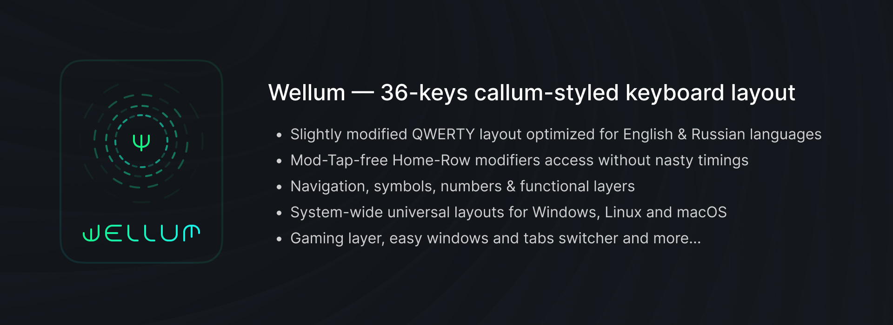

# Wellum — 36-keys callum-styled keyboard layout

[Эта статья также доступна на 🇷🇺 Русском языке.](README_RU.md)

## Table of contents

- [About firmware](#about-firmware)
- [Terms](#terms)
- [Keyboard layers](#keyboard-layers)
  - [Base layer](#base-layer)
  - [Symbols](#symbols)
  - [Navigation](#navigation)
  - [Numbers and F-keys](#numbers-and-f-keys)
  - [Special symbols](#special-symbols)
- Additional info
  - [How One-shot Sticky Modifiers work](#how-one-shot-sticky-modifiers-work)
  - [How Swapper and Tabber work](#how-swapper-and-tabber-work)

## About firmware

The firmware/layout is intended for use with [Universal Layout](https://github.com/braindefender/universal-layout) - a system-wide layout for Windows, Linux, and macOS. On the project page, you can find all the necessary instructions for installing and modifying this layout.

The firmware/layout is based on [callum](https://github.com/callum-oakley/qmk_firmware/tree/master/users/callum) and works on [QMK](https://docs.qmk.fm/), which is designed for wired keyboards. A version for wireless keyboards that work on [ZMK](https://zmk.dev/docs) is currently under development.

## Terms

- Modifiers: <kbd>Shift</kbd>, <kbd>Ctrl</kbd>, <kbd>Alt</kbd> or <kbd>Gui</kbd>
- Layer keys: <kbd>SYM</kbd> or <kbd>NAV</kbd>

## Keyboard layers

- Hold <kbd>SYM</kbd> to activate the symbols layer.
- Hold <kbd>NAV</kbd> to activate the navigation layer.
- Hold <kbd>SYM</kbd> and <kbd>NAV</kbd> together to activate the numbers layer.
- Hold <kbd>ALT</kbd> to activate the special symbols layer.

## Base layer

> Don't worry! Letters <kbd>Ё</kbd>, <kbd>Ъ</kbd> and <kbd>Щ</kbd> are placed on [ALT layer](#special-symbols).

## Symbols

## Navigation

On the left half, there are the <kbd>Game Layer</kbd>, <kbd>Print Screen</kbd>, and various macros:

|                    Key | Macro                                                                     |
| ---------------------: | ------------------------------------------------------------------------- |
|      <kbd>SW TAB</kbd> | [Swapper](#how-swapper-and-tabber-work) (for windows in Windows/Linux)    |
|      <kbd>SW WIN</kbd> | [Tabber](#how-swapper-and-tabber-work) (for tabs in browser and terminal) |
|    <kbd>PREV TAB</kbd> | <kbd>Ctrl</kbd> + <kbd>Shift</kbd> + <kbd>Tab</kbd>                       |
|    <kbd>NEXT TAB</kbd> | <kbd>Ctrl</kbd> + <kbd>Tab</kbd>                                          |
|  <kbd>SPACE LEFT</kbd> | <kbd>Ctrl</kbd> + <kbd>Gui</kbd> + <kbd>Left</kbd>                        |
| <kbd>SPACE RIGHT</kbd> | <kbd>Ctrl</kbd> + <kbd>Gui</kbd> + <kbd>Right</kbd>                       |

On the right half, there are Vim-like arrow keys, Home/End (on top), and Page Up/Down (on the bottom).

The <kbd>Escape</kbd>, <kbd>Enter</kbd> and <kbd>Tab</kbd> keys are duplicated on both halves, which is convenient for use in various software and editors where only the left hand is on the keyboard while the right hand holds the mouse.

## Numbers and F-keys

## Special symbols

The Russian letters that did not fit into the 2x15 grid and various symbols, many of which are arranged mnemonically, are placed in a layer:

|       Symbol | Input method                  |
| -----------: | ----------------------------- |
| <kbd>Ё</kbd> | <kbd>Alt</kbd> + <kbd>Е</kbd> |
| <kbd>Ъ</kbd> | <kbd>Alt</kbd> + <kbd>Ь</kbd> |
| <kbd>Щ</kbd> | <kbd>Alt</kbd> + <kbd>Ш</kbd> |
| <kbd>₽</kbd> | <kbd>Alt</kbd> + <kbd>Р</kbd> |

In place of the **space** is located the **non-breaking space** character, which prevents text from being divided between lines only at that point, and instead forces the entire group of adjacent words to move to the next line together.

The ALT layer also includes `<` `>` `«` `»` `[` `]` (available for both languages) and the `=>` ligature, which is convenient for developers.

## Gaming layer

WASD is shifted one column to the right to accommodate <kbd>Tab</kbd>, <kbd>Shift</kbd>, and <kbd>Ctrl</kbd> in almost familiar positions. This is also relevant for ergonomic keyboards due to the vertical offset of the keys, where the key under the middle finger is higher than the others.

Additionally, the layer with numbers contains two rows of digits and frequently used gaming keys:

|          Key | Description |
| -----------: | ----------- |
| <kbd>G</kbd> | Grenade     |
| <kbd>J</kbd> | Journal     |
| <kbd>I</kbd> | Inventory   |
| <kbd>M</kbd> | Map         |
| <kbd>T</kbd> | Chat        |

## How One-shot Sticky Modifiers work

When you hold layer key, modifiers will be added to a queue and remain pressed until some non-modifier key or layer key is pressed.

For example, to press the Windows <kbd>Gui</kbd> key without any combinations, you need to:

- hold down the layer key
- press the <kbd>Gui</kbd> modifier
- release the layer key and press it again.

And if you need, for example, to press the Ctrl+Shift+T combination, you have several options:

1. The first one:
   - Hold down the <kbd>SYM</kbd> layer key.
   - Type the <kbd>K (Ctrl)</kbd> and <kbd>J (Shift)</kbd> modifiers in any sequence.
   - Release the <kbd>SYM</kbd> layer key.
   - Type <kbd>T</kbd>.
2. The second one:
   - Hold down the <kbd>NAV</kbd> layer key.
   - Type the <kbd>D (Ctrl)</kbd> and <kbd>F (Shift)</kbd> modifiers in any sequence.
   - Release the <kbd>NAV</kbd> layer key.
   - Type <kbd>T</kbd>.

As soon as the <kbd>T</kbd> key is pressed, the queue of modifiers will be activated, cleared, and the <kbd>Ctrl+Shift+T</kbd> combination will be entered.

Moreover, if you hold down the modifier keys but release the layer key, the modifiers will remain held down, allowing you to use them in combinations with keys from the other half of the keyboard.

## How Swapper and Tabber work

The Swapper key <kbd>NAV+W</kbd> and the Tabber key <kbd>NAV+Q</kbd> are macros for <kbd>Alt+Tab</kbd> and <kbd>Ctrl+Tab</kbd>, respectively. When pressed, they leave the Alt or Ctrl modifiers held down.

Thus, by pressing <kbd>W</kbd> and <kbd>Q</kbd> again, you can switch between windows in Windows, tabs in a Web Browser, or Terminal.

These keys are compatible with the <kbd>Shift</kbd> modifier, which allows you to reverse the direction of window/tab switching.
